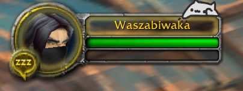
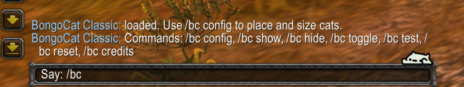
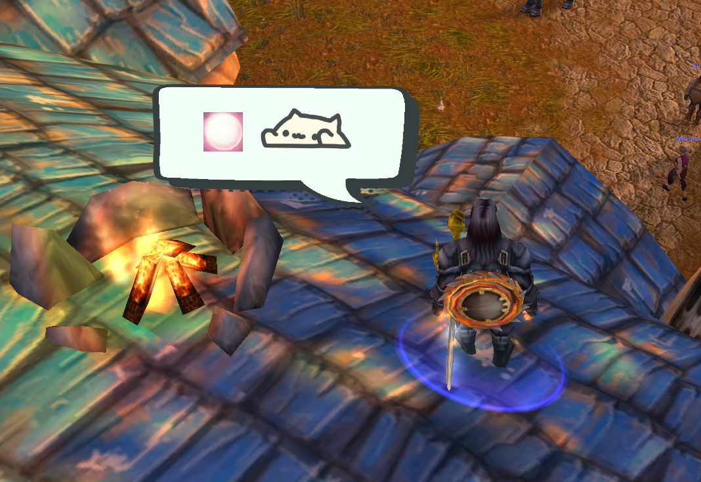

# BongoCat Classic

A small animated cat that taps along while you play World of Warcraft Classic.

## Install

1. Copy the `BongoCatClassic` folder into your Classic `Interface\AddOns` folder.
2. At the character-select screen, enable **BongoCat Classic**. If WoW says it is out of date, tick **Load out of date AddOns**.
3. Log in and type `/bc config` to set up your cats.

## Commands

- `/bc` — show help.
- `/bc config` — open the settings. Turn each cat on or off, drag it into place, and choose its size, colours, fading, and tap speed. The spell cat can also show your spell icon and a speech bubble.
- `/bc show`, `/bc hide`, `/bc toggle`
- `/bc reset` — restore the placement defaults.
- `/bc test` — play a short test animation.

## Screenshots

  
  

## Test notes

The cats tap when you type, use actions, cast spells, fight, move, or change targets. The most recently active cat normally gets the spotlight, so your screen stays uncluttered. Cats fade away after a short pause by default, and you can lock them so they do not get in the way of clicking.

If something does not work, please include your Classic client version and any error message when reporting it.

## Credits

Bongo Cat icon artwork from [kitgore/BongoCat](https://github.com/kitgore/BongoCat), used under MIT. Bongo Cat character/art concept by [@StrayRogue](https://x.com/StrayRogue). Original Bongo Cat video concept by @DitzyFlama.

The optional speech-bubble textures are adapted from **“speech bubble vector in halftone style set”** by [rawpixel.com on Magnific.com](https://www.magnific.com/free-vector/speech-bubble-vector-halftone-style-set_17225402.htm). Required attribution: **designed by rawpixel.com - Magnific.com**. They are included under the Magnific Free License with attribution.

See [THIRD_PARTY_NOTICES.md](THIRD_PARTY_NOTICES.md) for the complete third-party notices and [BongoCatClassic/Art/SPEECH_BUBBLE_CREDIT.md](BongoCatClassic/Art/SPEECH_BUBBLE_CREDIT.md) for the copy shipped with the add-on.
